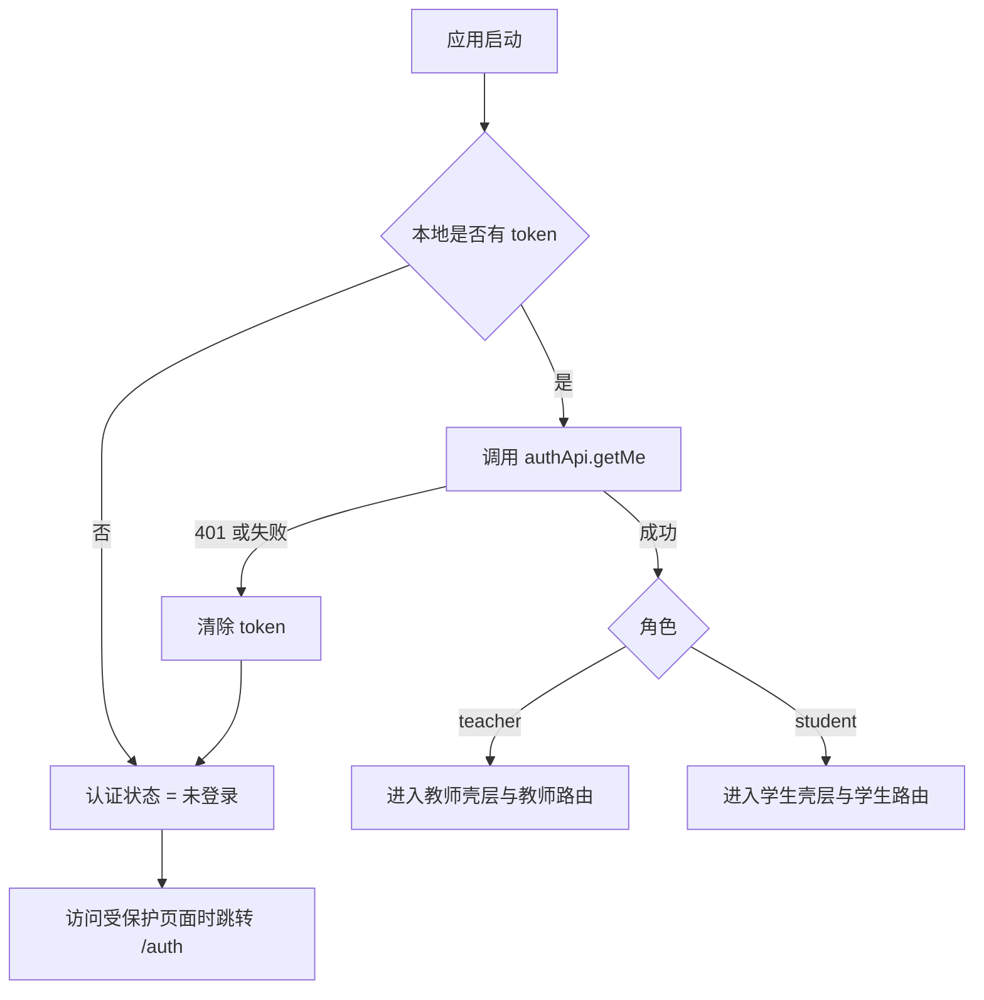
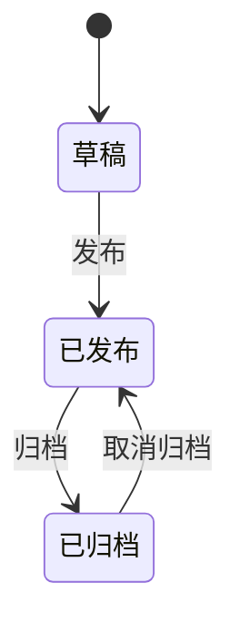
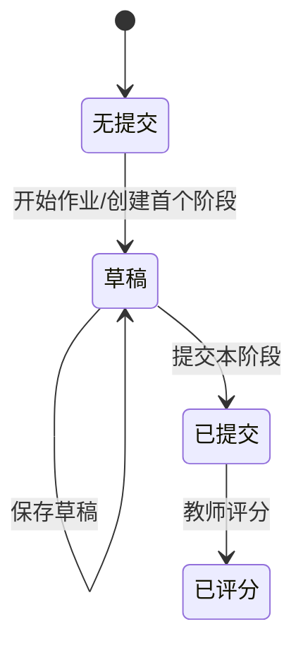
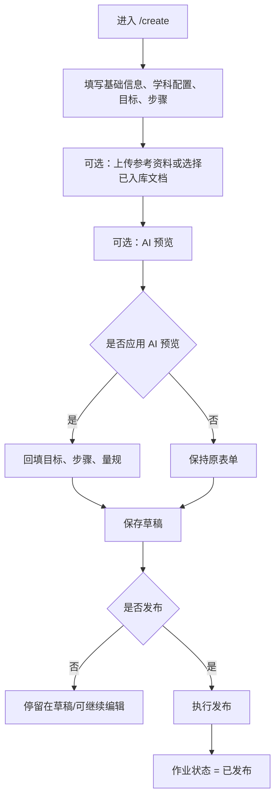
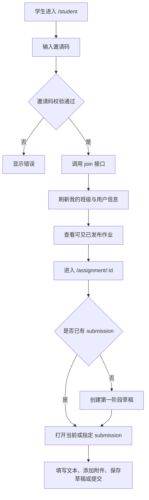
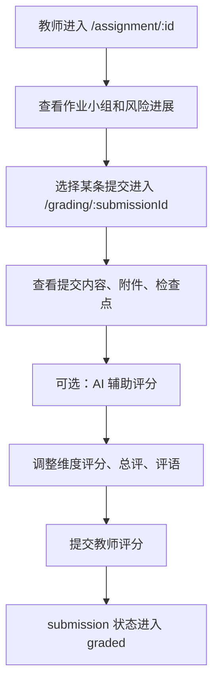

# CDAS 前端重设计需求说明书

最后更新：2026-03-24

## 1. 文档定位

本文档基于当前 `frontend/` 目录中的真实前端实现整理，目标是为后续使用 Pencil 进行前端重设计提供一份可执行的需求基线。

这不是新功能规划文档，而是“现状功能还原文档”。重设计阶段默认应保留现有业务能力、权限边界、状态切换和关键输入校验，除非另行提出改版决策。

## 2. 信息来源

当前需求整理主要来自以下实现文件：

- `frontend/src/app/routes.ts`
- `frontend/src/app/pages/*.tsx`
- `frontend/src/app/context/AuthContext.tsx`
- `frontend/src/app/lib/api.ts`
- `frontend/src/app/lib/mappers.ts`
- `frontend/src/app/validation/*.ts`
- `docs/PRODUCT_DESIGN.md`

## 3. 重设计范围

本次重设计需要覆盖以下已有页面与共用框架：

| 模块 | 路由 | 面向角色 |
| --- | --- | --- |
| 认证页 | `/auth` | 教师、学生 |
| 根布局壳层 | `/` 下全部子页面 | 教师、学生 |
| 教师仪表盘 | `/` | 教师 |
| 学生仪表盘 | `/student` | 学生 |
| 作业设计器 | `/create`、`/create?edit={assignmentId}` | 教师 |
| 班级与小组管理 | `/classes` | 教师 |
| 作业详情与提交 | `/assignment/:id`、`/assignment/:id?submission={submissionId}` | 教师、学生 |
| 批改页 | `/grading/:submissionId` | 教师 |
| 知识库 | `/knowledge` | 教师 |
| 404 页 | `*` | 全角色 |

## 4. 产品角色与权限

### 4.1 教师

教师当前可执行的前端动作：

- 登录、注册、退出登录
- 查看教师仪表盘
- 创建、编辑、保存、发布、归档、取消归档、删除作业
- 上传参考资料，触发 AI 预览、教案一键生成
- 查看作业详情、查看学生提交
- 创建作业小组、编辑作业小组成员、删除作业小组
- 创建班级、复制/重置邀请码、创建班级小组、删除班级小组、调整学生分组
- 管理知识库文档
- 在批改页使用 AI 辅助评分并提交教师评价

### 4.2 学生

学生当前可执行的前端动作：

- 登录、注册、退出登录
- 查看学生仪表盘
- 输入邀请码加入班级
- 查看已发布且对自己可见的作业
- 创建首个阶段草稿
- 保存草稿、提交当前阶段
- 查看教师反馈

### 4.3 权限边界

| 能力 | 教师 | 学生 |
| --- | --- | --- |
| 访问 `/create` | 是 | 否 |
| 访问 `/classes` | 是 | 否 |
| 访问 `/knowledge` | 是 | 否 |
| 访问 `/grading/:id` | 是 | 否 |
| 访问 `/student` | 否，会被重定向回 `/` | 是 |
| 访问教师首页 `/` | 是 | 否，会被重定向到 `/student` |

## 5. 全局信息架构与壳层

## 5.1 路由守卫与认证引导

根布局 `Root` 的行为规则如下：

- 启动时先由 `AuthContext` 执行 token 自检与 `getMe` 拉取。
- 如果未登录，则进入根布局后会被重定向到 `/auth`。
- 如果当前是学生身份，访问 `/`、`/create`、`/classes`、`/grading`、`/knowledge` 会被强制重定向到 `/student`。
- 如果当前是教师身份，访问 `/student` 会被强制重定向到 `/`。

对应的核心状态流如下：

## 5.2 根布局结构

登录后所有业务页面共享同一套双栏壳层：

- 左侧固定侧边栏
- 右侧主内容区
- 顶部固定头部
- 中间为页面内容容器

### 左侧侧边栏

通用元素：

- 品牌区：`CDAS` Logo、系统名、副标题
- 导航菜单
- 用户信息卡片
- “个人设置”按钮
- “退出登录”按钮

教师导航：

- 仪表盘 `/`
- 设计作业 `/create`
- 班级与小组 `/classes`
- 知识库 `/knowledge`

学生导航：

- 我的探索 `/student`
- 作业指引 `/student`

说明：

- 学生侧边栏中“我的探索”和“作业指引”当前都跳转到同一条路由 `/student`，属于同页双入口。
- “个人设置”按钮当前只有视觉表现，没有实际跳转或弹层逻辑。

### 顶部头部

教师与学生共用以下元素：

- 搜索输入框，placeholder 为“搜索作业、课标、文档...”
- 通知铃铛按钮
- 分隔线

教师额外元素：

- “发布作业”按钮，点击跳转 `/create`

学生额外元素：

- 欢迎信息 `欢迎, {user.name}`

说明：

- 搜索输入框当前未接实际搜索逻辑。
- 通知铃铛按钮当前未接实际通知逻辑。

## 5.3 共用反馈组件

### `PageState`

用于整个页面级状态展示，支持：

- `loading`
- `info`
- `warning`
- `error`

支持按钮回调或跳转按钮。

### `StatusBanner`

用于局部消息提示，支持：

- `success`
- `error`
- `info`
- `warning`

可选带一个动作按钮。

### 设计器专属悬浮反馈

作业设计器存在两类悬浮反馈：

- AI 处理中浮层
- 右下角 notice 浮层

后续重设计时这两类反馈建议保留为“非阻塞型状态提示”。

## 6. 核心业务实体与状态机

## 6.1 认证状态

| 状态 | 含义 | 触发方式 |
| --- | --- | --- |
| 未初始化 | App 启动后等待 token 自检 | `AuthProvider bootstrap` |
| 未登录 | 本地无 token 或 token 失效 | 初始无 token、401、手动退出 |
| 已登录-教师 | `user.role === teacher` | 登录/注册成功 |
| 已登录-学生 | `user.role === student` | 登录/注册成功 |

## 6.2 作业状态

| 状态 | 后端字段表现 | 可见入口 |
| --- | --- | --- |
| 草稿 | `is_published=false && !is_archived` | 教师历史作业、教师仪表盘 |
| 已发布 | `is_published=true && !is_archived` | 教师仪表盘、学生仪表盘、作业详情 |
| 已归档 | `is_archived=true` | 教师仪表盘、教师历史作业 |

状态转移：

## 6.3 知识库文档状态

| 状态 | 含义 |
| --- | --- |
| `uploaded` | 已上传，尚未开始或刚进入处理 |
| `indexing` | 正在解析与建立索引 |
| `ready` | 已入库，可被设计器引用 |
| `failed` | 处理失败 |

页面行为：

- 当存在 `uploaded/indexing` 文档时，知识库页每 3 秒自动刷新一次。
- 作业设计器只允许选择 `ready` 状态文档作为参考资料。

## 6.4 提交状态

| 状态 | 含义 |
| --- | --- |
| `draft` | 学生可编辑 |
| `submitted` | 学生已正式提交，等待教师评分 |
| `graded` | 教师已评分 |

状态转移：

补充规则：

- 阶段提交后，后端可能返回 `next_submission_id`，前端据此跳转到下一阶段草稿。
- 学生只有在当前 submission 为 `draft` 时才可编辑内容与附件。
- 教师在作业详情页只能查看，不可直接编辑学生提交。

## 6.5 作业小组与班级小组

系统里存在两套“小组”概念：

| 类型 | 页面 | 作用 |
| --- | --- | --- |
| 班级小组 | `/classes` | 班级层面的成员组织与日常分组 |
| 作业小组 | `/assignment/:id` | 针对具体作业的协作提交与批改聚合 |

这两套数据结构与入口独立，重设计时必须避免误合并。

## 7. 跨页面关键流程

## 7.1 教师设计并发布作业

## 7.2 学生加入班级并开始提交

## 7.3 教师查看提交与评分

## 8. 页面需求明细

## 8.1 认证页 `/auth`

### 页面目标

- 完成教师/学生的登录与注册
- 在同一页内切换身份和模式
- 登录后按角色分流进入不同首页

### 页面结构

左侧：

- 品牌视觉区
- 系统口号
- 两张说明卡片

右侧：

- 标题区：登录或注册标题、角色说明
- 角色切换条：教师/学生
- 表单区：登录表单或注册表单
- 错误提示文本
- 登录/注册模式切换入口
- 协议与版权区

### 交互逻辑

#### 角色切换

- 切换教师/学生会同步改变：
  - 登录字段标签
  - placeholder
  - 页面说明文案
  - 注册字段结构

#### 登录模式

字段：

- 账号标识：教师为工号，学生为学号
- 密码

校验：

- 标识不能为空
- 密码至少 8 位

提交流程：

1. 前端校验
2. 调用 `login(identifier, password, role)`
3. 若实际返回角色与当前切换角色不一致，则立即登出并报错
4. 教师跳转 `/`
5. 学生跳转 `/student`

失败表现：

- 在表单下方显示错误文本

#### 注册模式

公共字段：

- 姓名
- 工号/学号
- 手机号
- 密码

学生附加字段：

- 年级
- 班级

校验：

- 姓名必填
- 工号/学号需符合 `4-32` 位字母、数字、下划线、连字符
- 手机号若填写则需符合中国手机号格式
- 密码至少 8 位
- 学生必须填写年级和班级

提交流程：

1. 前端校验
2. 调用 `register`
3. 注册成功后自动登录
4. 按角色跳转

### 状态

- `mode`: `login | register`
- `role`: `teacher | student`
- `loading`
- `error`

### 当前占位/未接线项

- “服务协议”和“隐私政策”按钮无实际跳转

## 8.2 教师仪表盘 `/`

### 页面目标

- 为教师展示作业总览
- 提供快速进入设计器、详情页、编辑页的入口

### 页面元素

- 欢迎语与作业总数
- “设计新作业”按钮
- 4 张统计卡片：
  - 草稿作业
  - 已发布作业
  - 已归档作业
  - 班级管理说明
- 最近更新的作业列表
- 三张建议卡片：
  - 发布建议
  - 知识库增强
  - 班级功能进展

### 数据来源

- `assignmentsApi.list(1, 100, false, true)`
- `subjectsApi.list()`

### 交互逻辑

- 点击“设计新作业”进入 `/create`
- 点击“查看提交”进入 `/assignment/{assignmentId}`
- 点击“编辑”进入 `/create?edit={assignmentId}`
- 错误 Banner 可重试加载

### 页面状态

- 加载中
- 加载失败
- 最新作业为空
- 正常展示

## 8.3 学生仪表盘 `/student`

### 页面目标

- 展示学生可见作业
- 提供加入班级入口
- 展示班级与小组归属

### 页面元素

- 顶部欢迎 Hero
- 成功提示 Banner
- 作业列表卡片区
- 加入班级卡片
- 我的班级与小组卡片
- 学习建议卡片

### 数据来源

- `assignmentsApi.list(1, 100, true)`
- `subjectsApi.list()`
- `classesApi.listMy()`

### 数据过滤规则

- 学生仪表盘只加载已发布作业
- 如果当前用户带 `grade`，则仅显示 `assignment.grade === user.grade` 的作业

### 交互逻辑

#### 作业列表

- 点击标题或“进入任务”进入 `/assignment/{assignmentId}`

#### 加入班级

输入：

- 邀请码

校验：

- 必填
- 必须符合大写字母与数字的邀请码格式

成功后：

- 显示成功提示
- 清空输入框
- 调用 `refreshMe()`
- 重新加载班级与作业

#### 我的班级与小组

- 只读展示班级名称、年级、教师、成员数、已加入小组名

### 页面状态

- 加载中
- 加载失败
- 无可见作业
- 无班级
- 正常展示

## 8.4 作业设计器 `/create`

### 页面目标

- 教师完成跨学科作业的创建、编辑、AI 生成辅助、保存、发布和历史管理

### 顶层结构

- 顶部标题区
- Tab 切换：
  - `设计编辑`
  - `历史记录`

### 数据来源

- `subjectsApi.list()`
- `assignmentsApi.list(1, 100, false, true)`
- `documentsApi.list()`

### 关键内部状态

| 状态 | 说明 |
| --- | --- |
| `tab` | 编辑态或历史态 |
| `form` | 当前设计表单 |
| `referenceDocId` | 当前选中的参考资料 |
| `editingAssignmentId` | 当前是否在编辑已有作业 |
| `preview` | AI 预览结果缓存 |
| `saving/publishing/previewing/generatingFromLessonPlan/uploadingReference` | 各异步动作加载态 |
| `aiFeedbackFlow` | 当前 AI 反馈链路类型 |
| `showAdvancedStepFields` | 是否展开步骤高级字段 |

### 编辑态页面结构

#### 1. 基本信息

字段：

- 作业标题
- 探究主题
- 任务描述
- 学段
- 年级
- 周期（周）
- 截止日期

依赖关系：

- 学段切换后年级选项自动切换为：
  - 小学：1-6
  - 初中：7-9

#### 2. 学科与作业配置

字段：

- 主学科
- 融合学科多选
- 作业类型
- 实践子类型或探究子类型
- 探究深度
- 提交模式

依赖关系：

- 主学科和融合学科都按学段过滤
- 融合学科不能包含主学科
- 切换作业类型时自动重置默认评价维度
- `assignment_type === practical` 时展示实践子类型
- `assignment_type === inquiry` 时展示探究子类型

#### 3. 参考资料导入与选择

元素：

- 上传参考资料按钮
- 前往知识库按钮
- 从教案一键生成按钮
- 文档选择卡片列表

规则：

- 仅 `ready` 状态文档可选
- 默认允许“不选自定义资料，仅使用系统知识库”
- 上传成功但未 ready 时给 warning 提示

#### 4. 学习目标与任务步骤

元素：

- 背景设定 textarea
- 三个目标 textarea：
  - 知识与技能
  - 过程与方法
  - 情感态度
- 步骤列表
- “展开/收起高级字段”
- “添加步骤”
- 评价维度区

步骤核心字段：

- 任务动作
- 学习支架
- 提交证据

高级字段：

- 阶段名称
- 课时建议
- 评价要点

规则：

- 默认提供 4 个步骤
- 删除步骤时最少保留 2 个
- 评价维度默认由作业类型生成
- 可通过“恢复默认维度”重置

#### 5. 底部动作区

按钮：

- `AI 预览`
- `保存草稿`
- `发布作业`

#### 6. AI 预览结果区

展示：

- 来源信息
- 背景设定
- 三类目标
- 生成步骤数与评价维度数
- “应用到当前设计”按钮

#### 7. AI 浮动反馈

当触发 AI 操作时显示：

- 当前处于哪条 AI 流程
- 进度步骤列表

### 历史记录态页面结构

每个历史作业卡片展示：

- 标题
- 状态徽标
- 学段/年级/主题
- 创建时间
- 操作按钮：
  - 编辑
  - 发布
  - 归档 / 取消归档
  - 删除
  - 查看详情

### 交互逻辑

#### 编辑已有作业

- 通过 `?edit={assignmentId}` 进入
- 加载后回填表单
- 自动切换到编辑 Tab

#### AI 预览

前置条件：

- 需要通过 `preview` 模式校验

效果：

- 请求 `/api/v2/assignments/preview`
- 返回结果进入 `preview`
- 用户手动点击“应用到当前设计”才会覆盖表单

#### 从教案一键生成

前置条件：

- 必须先选择 `referenceDocId`

效果：

- 请求 `/api/v2/assignments/from-lesson-plan`
- AI 返回字段按“能补全就补全，没返回就保留用户当前值”的策略合并进表单
- 会清空已有 preview，直接覆盖正式表单

#### 保存草稿

校验规则：

- 只做较宽松校验：
  - 标题
  - 主题
  - 主学科
  - 年级与学段匹配
  - 学科关系合法

保存逻辑：

- 若 `editingAssignmentId` 存在则执行更新
- 否则执行创建

#### 发布作业

校验规则：

- 需满足保存校验
- 至少 2 个步骤
- 每个步骤必须有阶段、名称、描述、提交证据
- 至少 2 个评价维度
- 评价维度不可重复

发布逻辑：

- 若尚未创建过 assignment，则先创建再发布
- 若已存在，则先更新后发布

#### 删除作业

- 需要浏览器 confirm 二次确认

### 重要业务约束

- 背景设定会从 `objectives_json.process` 中拆出并单独编辑，保存时再合并回去。
- 步骤编辑器前端展示的是“扁平步骤列表”，提交给后端前会通过 `lessonStepsToPhases` 重新组装为 phases。
- 当前页面底部明确提示：后端更新接口暂不支持所有结构化字段的全量更新，因此编辑已有作业时会优先保存目标、流程和量表内容。

## 8.5 班级与小组管理 `/classes`

### 页面目标

- 教师创建班级、管理邀请码、建立班级小组并分配学生

### 页面结构

#### 顶部班级创建区

字段：

- 班级名称
- 年级

动作：

- 创建班级

#### 左侧“我的班级”

- 班级列表
- 当前选中态

#### 右侧班级详情

包括：

- 班级名称与成员数
- 复制邀请码按钮
- 重置邀请码按钮
- 当前邀请码展示
- 班级小组区
- 入班学生与分组区

### 数据来源

- `classesApi.listMy()`
- `classesApi.listMembers(classId)`
- `classesApi.listGroups(classId)`

### 交互逻辑

#### 创建班级

校验：

- 名称必填
- 名称不超过 100 个字符

成功后：

- 班级加入左侧列表顶部
- 自动选中新班级

#### 复制邀请码

- 优先写入剪贴板
- 若剪贴板失败，则退化为直接显示邀请码文本 notice

#### 重置邀请码

- 调用后更新当前班级邀请码

#### 创建班级小组

校验：

- 必须先选班级
- 组名必填
- 组名不能超过 100 个字符
- 当前班级范围内不能重名

#### 删除班级小组

- 需要浏览器 confirm

#### 学生分组调整

- 每个学生右侧为 select
- 可切换到某个班级小组
- 也可选择“未分组”
- 变更后会重新加载 members 和 groups

### 页面状态

- 页面整体加载中
- membersLoading
- groupsLoading
- creating
- creatingGroup
- updatingStudentId
- deletingGroupId
- resetting

## 8.6 知识库 `/knowledge`

### 页面目标

- 管理系统内置课程标准知识库概览
- 上传、查看、删除教师自定义文档

### 页面结构

#### 顶部标题区

- 页面标题
- 上传文档按钮

#### 系统内置课程标准知识库区

内容：

- 就绪/异常状态徽标
- 说明文字
- 3 张统计卡片：
  - 内置文档数
  - chunks 数
  - 就绪文档数
- 学科标签云

说明：

- 系统内置文档不会逐条展示，只展示聚合概览

#### 我的教学资料区

每条文档展示：

- 文件名
- 上传时间
- 状态
- 错误信息（如有）
- 删除按钮

### 数据来源

- `documentsApi.list()`

### 交互逻辑

#### 上传文档

限制：

- 仅支持 `.pdf/.docx/.txt`
- 文件不能为空
- 不得超过 10MB

成功后：

- 立即刷新列表
- 显示成功提示

#### 自动刷新

- 当存在 `uploaded/indexing` 文档时，每 3 秒自动拉取最新状态

#### 删除文档

- 需要浏览器 confirm

### 页面状态

- `isLoading`
- `uploading`
- `deletingId`
- `processingCount > 0` 时的自动刷新提醒

## 8.7 作业详情与提交 `/assignment/:id`

这是当前前端最复杂的双角色页面，不同角色看到的功能完全不同。

### 页面公共头部

展示：

- 作业标题
- 描述或主题
- 学段、年级、提交模式
- 背景设定
- 返回链接
- notice Banner
- error Banner

若存在背景设定，会将 `背景设定` 与 `任务主线` 单独展示。

### 教师模式

#### 1. 顶部提醒

- 一条 amber Banner，提示教师建议通过“评价批改”页面查看学生提交并评分

#### 2. 作业小组（协作模式）区

功能：

- 输入小组名称
- 选择成员来源班级
- 勾选班级学生
- 创建作业小组

子功能：

- 搜索可选成员
- 全选/清空
- 查看已建作业小组
- 编辑作业小组成员
- 删除作业小组

编辑成员时可：

- 切换班级来源
- 搜索成员
- 勾选/取消成员
- 保存或取消

#### 3. 小组提交进展区

对每个作业小组做风险聚合，展示：

- 风险标签
- 阶段进度
- 提交次数
- 待评分数
- 已评分数
- 最近提交时间
- 最近评分时间
- “批改最新提交”链接

风险筛选：

- 全部
- 仅高风险

风险判定逻辑：

- 已逾期未提交
- 临近截止未提交
- 已截止待评分
- 有待评分提交
- 正常

#### 4. 提交浏览区

若该作业已有 submission，会进入和学生共用的下半部分内容，但教师为只读。

教师额外能力：

- 顶部可按小组过滤 submission
- 阶段 chips 可切换不同 submission
- 可直接点击“进入评分”

### 学生模式

#### 1. 无提交记录时

展示：

- 说明文字
- 当前是个人模式还是小组模式
- “开始作业”按钮

点击后：

- 创建 `phase_index = 0` 的第一阶段草稿
- 若学生属于作业小组，则自动带上 `group_id`

#### 2. 有提交记录时

展示：

- submission 阶段 chips
- 当前阶段说明卡
- 当前阶段步骤与检查点
- 若为小组提交，显示小组名与成员
- 我的提交内容 textarea
- 附件链接编辑区
- 保存草稿按钮
- 提交本阶段按钮
- 右侧教师反馈卡
- 右侧提交建议卡

### 当前阶段区

会根据 `activeSubmission.phase_index` 对应到 assignment 的 phase，展示：

- 阶段标题或阶段名称
- 每个步骤
- 每个步骤的学习支架
- 每个步骤的提交证据清单

### 证据检查清单

仅在学生可编辑状态下出现。

来源：

- 从当前 phase 的 steps.checkpoints 提取唯一提示项

功能：

- 显示每个证据提示
- 显示当前已覆盖数量
- 点击提示项可自动插入到“我的提交内容”

### 学生提交编辑区

#### 文本内容

- textarea
- 当 submission 不可编辑时禁用

#### 附件链接

字段：

- 附件名称
- 附件 URL

规则：

- 名称和链接都不能为空
- 链接必须为 `http/https`
- 不允许添加重复附件

#### 保存草稿

- 调用 `submissionsApi.update`

#### 提交本阶段

前置校验：

- 附件必须全部合法
- 正式提交前必须至少有一项证据：
  - 文本
  - 附件
  - checkpoint

提交后行为：

- 先更新当前内容
- 再调用 submit 接口
- 若后端返回 `next_submission_id`，自动跳转到下一阶段 submission
- 否则根据 submission mode 与是否最终阶段提示不同文案

### 查询参数逻辑

- `?submission={submissionId}` 可用于指定打开某条 submission
- 若不传，学生端默认打开最后一条；教师端默认打开当前筛选结果下第一条

### 可编辑性规则

`readOnly = user 不是 student 或 当前 submission.status !== draft`

即：

- 教师永远只读
- 学生只有 draft 可编辑

## 8.8 批改页 `/grading/:submissionId`

### 页面目标

- 教师对一条 submission 进行评分
- 同时查看该作业下按小组聚合的提交进展

### 页面结构

左侧：

- 作业与提交基础信息
- 返回作业详情链接
- 小组聚合视图
- 提交内容
- 附件
- 检查点完成情况

右侧：

- 评分面板

### 数据来源

- `submissionsApi.getById(submissionId)`
- `assignmentsApi.getById(submission.assignment_id)`
- `evaluationsApi.listBySubmission(submissionId)`
- `submissionsApi.listByAssignment(assignmentId)`
- `assignmentsApi.listGroups(assignmentId)`

### 小组聚合视图

功能：

- 按“全部 / 仅个人 / 指定作业小组”过滤
- 展示聚合单元数、高风险组、待评分数、已评分数、总提交数、草稿数
- 展示每个聚合单元的风险、阶段进度、最近提交和评分时间
- 可跳转查看该组最新 submission

### 评分面板

#### 评分维度滑杆

- 按作业量规维度逐项评分
- 分值范围 `1-4`
- 旁边显示中文等级

#### 总评价滑杆

- 分值范围 `1-4`

#### 教师评语

- textarea

#### AI 辅助

点击后：

- 调用 `evaluationsApi.aiAssist`
- 回填维度分、总分、评语
- 用户仍需手动确认并提交

#### 提交评分

校验：

- 教师评语不能为空
- 如果有量规维度，则 `dimensionScores` 必须与量规维度完全一致
- 所有维度分必须在 `1-4`

成功后：

- 显示“评分提交成功”
- 重新加载 submission 与 evaluation 数据

### 初始化逻辑

- 若该 submission 已经存在教师评价，则回填已有评分
- 若没有，则按作业量规维度初始化默认分值 3

## 8.9 404 页

### 页面目标

- 对未知路由给出兜底反馈

### 设计要求

- 与系统统一的 `PageState` 风格保持一致即可
- 需要有返回主页面入口

## 9. 当前前端中的占位交互与“看起来可点但未接业务”的元素

后续重设计时，这些元素需要明确标注是保留为占位，还是纳入本轮补全范围：

- 根布局顶部搜索框当前无搜索逻辑
- 根布局顶部通知铃铛当前无通知逻辑
- 侧边栏“个人设置”按钮当前无页面或弹层
- 学生侧边栏“作业指引”与“我的探索”是同一路由
- 登录页“服务协议”“隐私政策”按钮无跳转
- 学生提交中的附件目前只支持“链接录入”，不支持直接上传文件
- 前端存在 `self/peer evaluation` API，但当前界面未提供学生自评、互评入口

## 10. Pencil 重设计时必须保留的核心约束

以下约束来自现有实现和产品基线，重设计不能丢失：

- 必须保留教师与学生双角色入口，并在登录前允许切换角色
- 必须保留登录后按角色重定向与路由守卫
- 必须保留教师与学生不同的信息架构
- 必须保留作业设计器的“编辑态 + 历史态”双视图
- 必须保留 AI 预览与“从教案一键生成”两条链路
- 必须保留作业详情页的双角色模式
- 必须保留 submission 的阶段化流转
- 必须保留班级小组与作业小组两套模型
- 必须保留知识库文档状态与自动刷新反馈
- 必须保留教师评分的 1-4 四档模型
- 必须保留页面级 loading/error/empty/permission denied 状态

## 11. 建议的 Pencil 设计拆分单元

为了便于后续在 Pencil 中落图，建议按以下单元拆页面：

1. 认证页
2. 根布局壳层
3. 教师仪表盘
4. 学生仪表盘
5. 作业设计器-编辑态
6. 作业设计器-历史态
7. 班级与小组管理
8. 知识库
9. 作业详情-教师态
10. 作业详情-学生无提交态
11. 作业详情-学生有提交态
12. 批改页
13. 通用空态/错态/加载态组件

## 12. 结论

当前 CDAS 前端并非单纯内容展示站点，而是一套围绕“作业设计、班级组织、过程提交、教师批改、知识库辅助”构成的多角色业务系统。

因此重设计重点不应只放在视觉焕新，而应围绕以下三件事组织：

- 让教师主链路更清晰：设计作业、组织班级、跟踪提交、进入评分
- 让学生主链路更低负担：入班、看任务、按阶段提交、查看反馈
- 让系统状态更可见：AI 生成进度、文档入库状态、提交状态、评分状态、风险状态

这份文档可作为后续 Pencil 信息架构、页面框架图、低保真原型和重设计任务拆分的直接输入。
